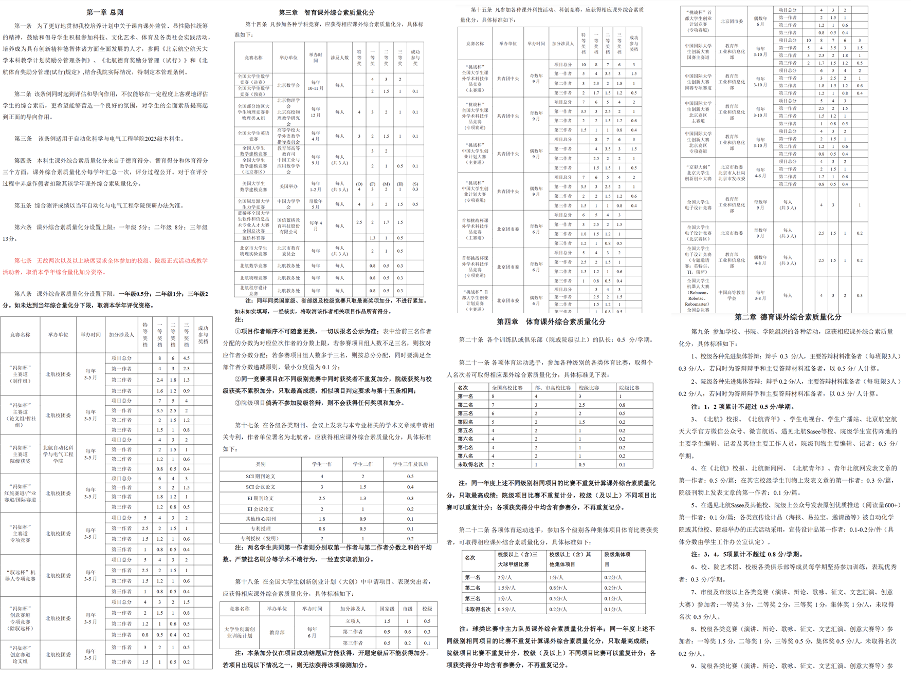
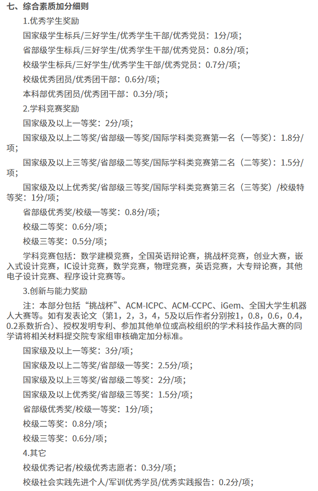

# 为什么是国科大

如果让我概括国科大最大的优势，我会说是“**安逸**”。这种安逸不是课业压力上的减负，而是机制与制度上的减负：

- 可以自由转换专业；
- 没有冗长、需要逐项去刷的保研加分清单；
- 有充足的保研名额；
- 有较完善的保底机制，比如未来技术学院。

> 为了直观展示这种区别，我以保研加分为例：
>
> 这是北航的部分保研加分制度：
>
> 
>
> 北航每个学期都设有加分上限。因此，想争取保研的人，往往从大一开始就要在每个学期参加各类活动、比赛和科研，尽量把加分刷满。
>
> 反观国科大，我们只在大三保研时计算一次加分，并且只有四项，每项取最高：
>
> 
>

这些制度保障，让学生不必因为“没书读”而焦虑内卷，也因此，国科大的学习氛围相比外校更轻松。

但安逸本身也有利有弊。负担小，也可能意味着动力小。尤其是刚进入大学的人，绝大多数人信息并不灵通，也不会早早确定人生方向。如果一上来就置身于安逸的环境中，反而可能是在给自己“安乐死”。具体表现为：

- 只关心课内成绩，把时间几乎都花在课内学习上；
- 不参加活动、比赛；
- 也不提前进组做科研。

最终的结果是，还没反应过来，就到大三准备保研了。然后突然发现，自己没有什么经历、资源或成长，简历上只有几个课内 lab，根本无法和那些在外校高竞争环境中成长起来的人竞争。最后，只能凭上课时对某位导师的印象来选择去向，对导师的人品、能力以及组内氛围几乎一无所知。

这并不意味着外校学生天生更勤奋，我们天生更浑噩。其实，大部分大学生本质上都是迷茫的，大家都只是被环境推着走：

- 在很卷的环境里，就拼命参加比赛、拿奖、进组科研、发 paper；
- 在安逸的环境里，就很容易忽视这些机会，被眼前的课内和考试一叶障目。

但客观上，前者容易带来成长，后者容易造成停滞。

> 举个例子：浙大的典型升级路径是，第一年拼命卷绩点，卷到年级前几；第二年开始凭借绩点四处套磁 top lab，做科研、发 paper；再利用这些 paper 和资源进入下一个阶梯……这已经是一套可以稳定运转的流程。本质上，它也是一种 reward hacking；只不过不同制度会生长出不同的 hacking 模式，而这种模式的副作用，恰好是更宽广的眼界和更扎实的能力提升。

所以，**国科大的安逸环境是一把双刃剑：它奖励积极主动的人，也惩罚浑浑噩噩的人**。

理想的状态，是借着国科大为大家撑起的保护伞，大胆去闯荡、去尝试、去经历、去试错、去成长；不必被各种意义不大的比赛和活动干扰，也不必因为担心课内竞争失利就无处可去而束手束脚。这才是国科大能提供给大家的宝藏：**自我探索的自由**。

如果你每天只为期中期末发愁，或者干脆整日窝在宿舍打游戏，那其实是在浪费这份难能可贵的宝藏。

但这不怪大家。真正的问题在于：国科大搭好了环境，却没有给出足够的引导。所以，这也是我们想做这样一个网站的初衷。欢迎所有有话想说的人参与建设，让后来者能更好地利用学校的资源。
